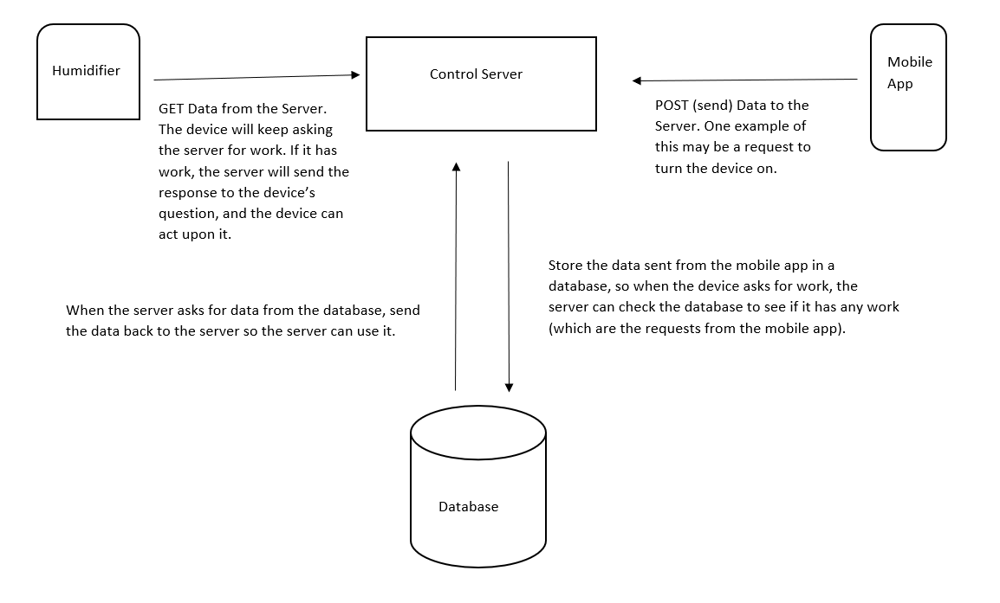

# About the Project

### The Idea
The idea is to make a smart device that can react based on 'on-device intelligence'. A smartphone-based application will also be created to control the device directly, and one of the first devices that came to my mind was a humidifier, leading to make the smart humidifier project.

### Core Requirements
Respond to user inputs from the phone, and use on-device intelligence to smartly figure out the actions to take automatically. One example of this was to be able to schedule the device to turn on at a certain time, or when the temperature drops below a certain level. The user should be able to control the device even when they are far away from the device location, and as well as when the user’s phone and the humidifier are connected to different Wi-fi networks.

### What Problem Does This Idea Resolve?
The idea helps to automatically maintain the humidity of a room based on the surrounding air temperature by detecting temperature changes. Along with the main idea, some additional benefits include cost and energy savings through the automation of humidifier operation, and have the ability to control the device outside of its Wi-Fi network.

### High Level Architecture

